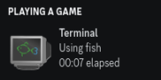

# terminal-discord-rpc
Adds Discord's rich presence to your Terminal

## Requirements
- Rust
- Discord
- Linux

## Setup
1. Clone the repo
```sh
git clone https://github.com/anotherlusitano/terminal-discord-rpc.git
```

2. Build the app
```sh
cd terminal-discord-rpc
cargo build --release
```

3. Execute the application
```sh
./target/release/terminal-discord-rpc
```

## Screenshots



